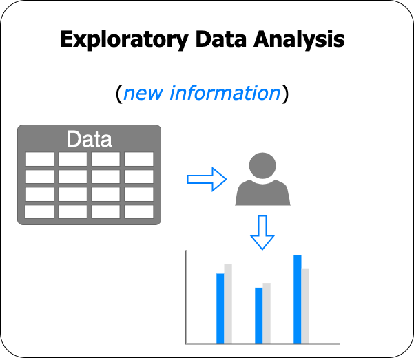
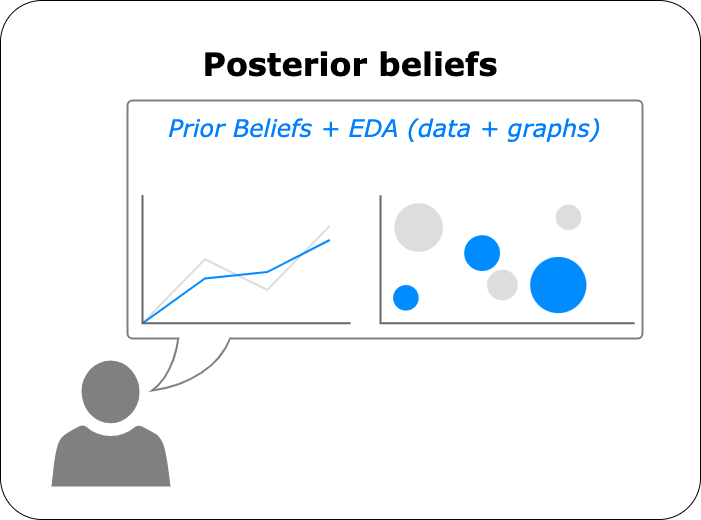
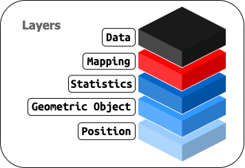
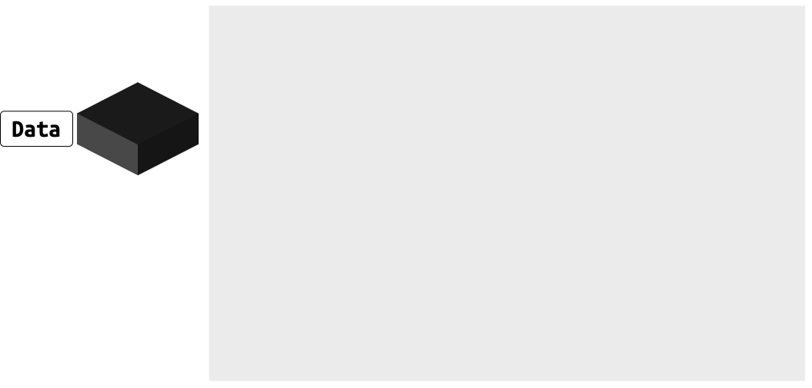
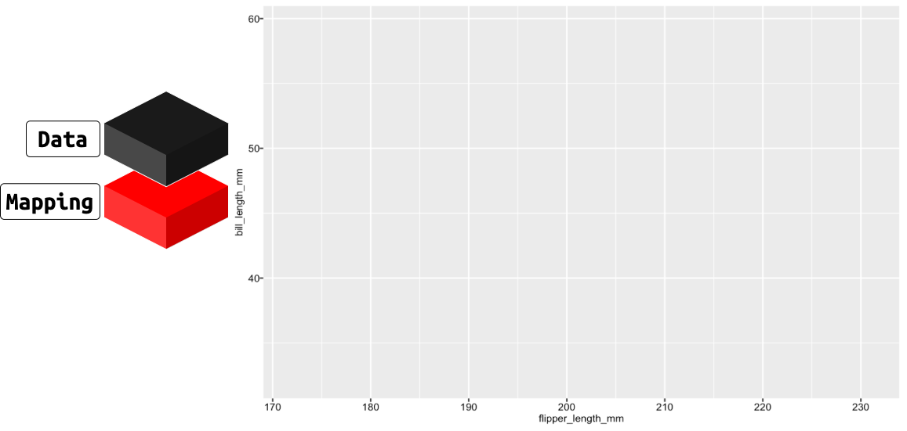
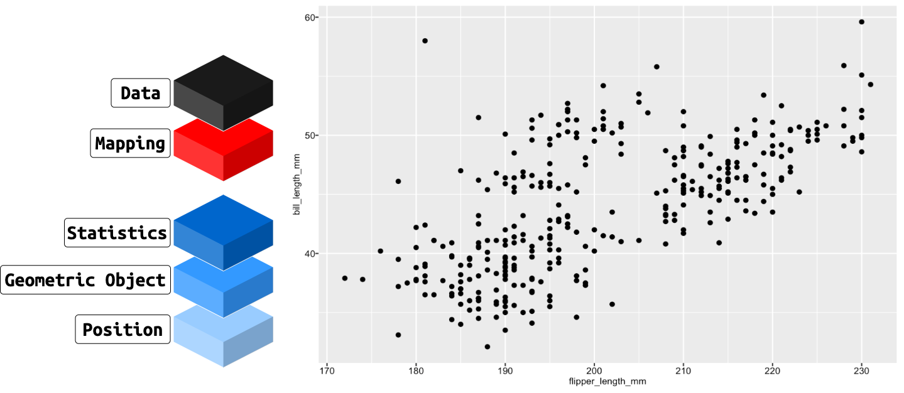
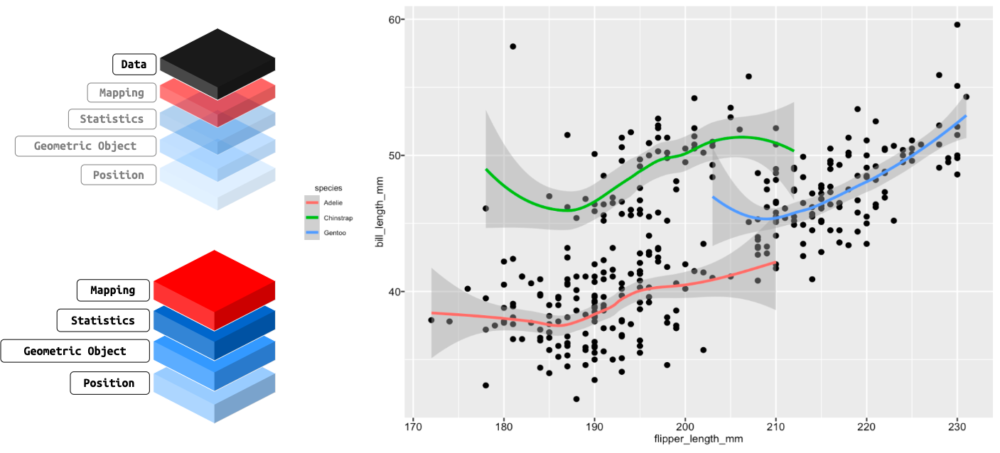
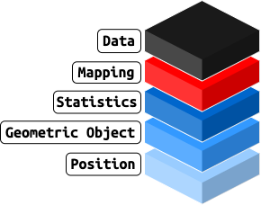

```{r meta, echo=FALSE}
# infinite moon reader ----
# xaringan::inf_mr()
library(metathis)
meta() %>%
  meta_general(
    description = "ODSC: Exploratory Data Visualization with ggplot2",
    generator = "xaringan and remark.js"
  ) %>%
  meta_name("github-repo" = "mjfrigaard/odsc-ggplot2-2022/tree/gh-pages") %>%
  meta_social(
    title = "ODSC: Exploratory Data Visualization with ggplot2",
    url = "https://mjfrigaard.github.io/odsc-ggplot2-2022/",
    og_type = "website",
    og_author = "Martin Frigaard",
    twitter_card_type = "summary",
    twitter_creator = "@mjfrigaard"
  )
```

```{r setup, include=FALSE}
dateWritten <- format(as.Date("2022-02-08"), format = "%B %d %Y")
today <- format(Sys.Date(), format = "%B %d %Y")
library(knitr)
library(tidyverse)
library(fontawesome)
options(
  htmltools.dir.version = FALSE,
  knitr.table.format = "html",
  knitr.kable.NA = ""
)
knitr::opts_chunk$set(
  warning = FALSE,
  message = FALSE,
  fig.path = "images/",
  fig.width = 7.252,
  fig.height = 4,
  comment = "#>",
  fig.retina = 3 # Better figure resolution
)
# Enables the ability to show all slides in a tile overview by pressing "o"
xaringanExtra::use_tile_view()
xaringanExtra::use_panelset()
xaringanExtra::use_clipboard()
xaringanExtra::use_share_again()
xaringanExtra::style_share_again(share_buttons = "all")
xaringanExtra::use_extra_styles(
  hover_code_line = TRUE,
  mute_unhighlighted_code = FALSE
)
```

layout: true

<!-- this adds the link footer to all slides, depends on footer-small class in css-->

<div class="footer-small"><span>https://github.com/mjfrigaard/talks/tree/main/odsc-eda-2022-04</span></div>

---
name: title-slide
class: title-slide, center, middle, inverse

# `r rmarkdown::metadata$title`
#.fancy[`r rmarkdown::metadata$subtitle`]

<br>

.large[by Martin Frigaard]

Written: `r dateWritten`

Updated: `r today`

---
class: left, top, inverse
background-image: url(images/ODSC_Logo_2020.png)
background-position: 95% 8%
background-size: 12%

# Resources 

<br>

.leftcol[

## Links:

### - [Conference Website](https://odsc.com/boston/)

### - [Website](https://mjfrigaard.github.io/odsc-ggplot2-2022/)

### - [Part 1](https://mjfrigaard.github.io/odsc-ggplot2-2022/eda-slides-01.html#1)

### - [Part 2](https://mjfrigaard.github.io/odsc-ggplot2-2022/eda-slides-02.html#1)

]

.rightcol[

## Materials:

### - [RStudio.Cloud]() (*coming soon!*)

### - [Github Repo](https://github.com/mjfrigaard/odsc-ggplot2-2022/tree/gh-pages) 

]

---
class: left, top, inverse
background-image: url(images/ODSC_Logo_2020.png)
background-position: 95% 8%
background-size: 12%

## Outline 

.leftcol[

### .red[Part 1]

**Exploratory Data Analysis**

- *What is it, who does it, and why it's important*

**A Bayesian Mindset**

- *Priors -> new information -> posteriors*

**The grammar of graphics**

- *Layers, aesthetics, and geoms*

]

--
 
.rightcol[

### Part 2

**Graphs & mental models**

- *Mental representations graph elements*

**Creating graphs with ggplot2**

- *Build from scratch, layer-by-layer*

**.fancy[Re]-creating graphs with ggplot2**

- *Mapping data to graph elements*

]

---
class: center, middle, inverse
background-image: url(images/ODSC_Logo_2020.png)
background-position: 95% 8%
background-size: 12%

# .fancy[.large[PART 1]]

---
class: center, middle
background-image: url(images/ODSC_Logo_2020.png)
background-position: 95% 8%
background-size: 12%

<br>

# **.fancy[.darkblue[.large[Exploratory Data Analysis (EDA)]]]**

---
class: left, top, inverse
background-image: url(images/ODSC_Logo_2020.png)
background-position: 95% 8%
background-size: 12%

# .center["EDA"]

.leftcol[

### "Exploratory Data Visualization" first coined by American mathematician John Tukey in 1977

]

.rightcol[

```{r eda-tukey, echo=FALSE, fig.align='center', out.height='50%', out.width='50%'}
knitr::include_graphics("images/eda-tukey.jpg")
```

]

---
class: left, top, inverse
background-image: url(images/ODSC_Logo_2020.png)
background-position: 95% 8%
background-size: 12%

# What is EDA? 

#### John T. Behrens, [Principles and Procedures of Exploratory Data Analysis](https://psycnet.apa.org/record/1997-06270-001):

<br>

> .blue[*Emphasis on substantive understanding of data*]

>   .blue[*- i.e. "what is going on here?"*]

--

> .blue[*Iterative process with a focus on graphic representations of data*]


---
class: left, top, inverse
background-image: url(images/ODSC_Logo_2020.png)
background-position: 95% 8%
background-size: 12%

# What is EDA? 

#### John T. Behrens, [Principles and Procedures of Exploratory Data Analysis](https://psycnet.apa.org/record/1997-06270-001):

<br>

> .blue[*- Includes subset analyses, skepticism, and flexibility*]

--

> .red[*- The role of the data analyst is to listen to the data in as many ways as possible until a plausible "story" of the data is apparent*]


---
class: left, top, inverse
background-image: url(images/ODSC_Logo_2020.png)
background-position: 95% 8%
background-size: 12%

# Who does EDA? 

#### John Tukey, [Exploratory Data Analysis](http://www.ru.ac.bd/wp-content/uploads/sites/25/2019/03/102_05_01_Tukey-Exploratory-Data-Analysis-1977.pdf):

<br>

> .blue[*A detective investigating a crime needs both tools and understanding.*]

--

> .blue[*If he has no fingerprint powder, he will fail to find fingerprints on most surfaces.*]

--

> .blue[*If he does not understand where the criminal is likely to have put his fingers, he will not look in the right places.*]

--

> .red[*Equally, the analyst of data needs both tool and understanding.*]


---
class: left, top, inverse
background-image: url(images/ODSC_Logo_2020.png)
background-position: 95% 8%
background-size: 12%

# EDA is a 'state of mind' 

#### Hadley Wickham, [R for Data Science](https://r4ds.had.co.nz/exploratory-data-analysis.html):

<br>

> .red[*More than anything, EDA is a state of mind.*]

--

> .blue[*During the initial phases of EDA you should feel free to investigate every idea that occurs to you. Some of these ideas will pan out, and some will be dead ends.*]

--

> .blue[*As your exploration continues, you will home in on a few particularly productive areas that you’ll eventually write up and communicate to others.*]


---
class: left, top, inverse
background-image: url(images/ODSC_Logo_2020.png)
background-position: 95% 8%
background-size: 12%

# Why is EDA important?

--

> .blue[*"Data are becoming the new raw material of business"* - Craig Mundie, CEO at Microsoft]

--

> .blue[*"Data is the oil of the digital era"* - [The  Economist](https://www.economist.com/leaders/2017/05/06/the-worlds-most-valuable-resource-is-no-longer-oil-but-data)]

--

```{r parkins-data-oil-png, echo=FALSE, eval=TRUE, fig.align='center', out.height='50%', out.width='50%'}

```

<div class="footer-small"><span>https://www.economist.com/leaders/2017/05/06/the-worlds-most-valuable-resource-is-no-longer-oil-but-data</span></div>

---
class: left, top, inverse
background-image: url(images/ODSC_Logo_2020.png)
background-position: 95% 8%
background-size: 12%

# Why is EDA important?

### Data are complex:

```{r Big-Data-Reporting, echo=FALSE, eval=TRUE, fig.align='center', out.height='60%', out.width='60%'}

```

--

*It's hard to derive insight from data in it's raw form!*


---
class: left, top, inverse
background-image: url(images/ODSC_Logo_2020.png)
background-position: 97% 6%
background-size: 10%

# EDA is a means of .blue[visualizing complexity]

<br>

--

### - *It's hard to make sense of a dataset or database with millions of rows and thousands of columns*

--

### - *Fortunately, humans are excellent at seeing patterns:*

--

```{r superior-pattern-processing.png, echo=FALSE, eval=TRUE, fig.align='right', out.height='80%', out.width='80%'}

```

.footer[.small[.right[[Superior pattern processing is the essence of the evolved human brain](https://www.frontiersin.org/articles/10.3389/fnins.2014.00265/full) - Frontiers in Neuroscience]]]


---
class: left, top, inverse
background-image: url(images/ODSC_Logo_2020.png)
background-position: 95% 8%
background-size: 12%

# What do you need?

<br>

--

## **Tools** = R, RStudio, Adobe, sketch pad, text editor (Atom, Sublime Text, Vim)  

<br>

--

## **Understanding** = *...experience and feedback*

---
class: center, middle
background-image: url(images/ODSC_Logo_2020.png)
background-position: 95% 8%
background-size: 12%

<br>

# **.fancy[.darkblue[.large[A Bayesian Mindset]]]**

---
class: left, top, inverse
background-image: url(images/ODSC_Logo_2020.png)
background-position: 95% 8%
background-size: 12%

## A Bayesian Mindset

--

### .center[*What we thought we knew (.orange[what we expect])*]

--

# .large[.center[+]]

--

### .center[*New information (.orange[what we see])*]

--

# .large[.center[=]]

--

### .center[*What we think now (.orange[what we've learned])*]

---
class: left, top, inverse
background-image: url(images/ODSC_Logo_2020.png)
background-position: 95% 8%
background-size: 12%

## A Bayesian Mindset

<br>

### We all have implicit beliefs (.red[*'priors'*]) about the world

--

<br>

### When we encounter new data or information, our *priors* get updated

--

<br>

### These updated beliefs (.red[*'posteriors'*]) depend on our implicit beliefs and our **perceptions** of the new information


---
class: left, top, inverse
background-image: url(images/ODSC_Logo_2020.png)
background-position: 95% 8%
background-size: 12%

# A Bayesian Mindset

--

.leftcol40[

<br>

### *Before EDA, we start with expectations and/or assumptions about the data*

]

--

.rightcol60[

```{r bayesian-eda-prior-png, echo=FALSE, eval=TRUE, fig.align='center', out.height='80%', out.width='80%'}
knitr::include_graphics("images/bayesian-eda-priors.png")
```

]


---
class: left, top, inverse
background-image: url(images/ODSC_Logo_2020.png)
background-position: 95% 8%
background-size: 12%

# A Bayesian Mindset

--

.leftcol40[

<br>

### *During EDA, we observe new information that either confirms or contradicts our prior beliefs*

]

--

.rightcol60[

```{r bayesian-eda-new-png, echo=FALSE, eval=TRUE, fig.align='center', out.height='80%', out.width='80%'}

```

]


---
class: left, top, inverse
background-image: url(images/ODSC_Logo_2020.png)
background-position: 95% 8%
background-size: 12%

## A Bayesian Mindset

--

.leftcol40[

<br>

### *After EDA, we have a new set of beliefs which account for the observed data*

]

--

.rightcol60[

```{r bayesian-eda-posteriors-png, echo=FALSE, eval=TRUE, fig.align='center', out.height='80%', out.width='80%'}

```


]


---
class: left, top, inverse
background-image: url(images/ODSC_Logo_2020.png)
background-position: 95% 8%
background-size: 12%

# EDA is .green[systematic, technical creativity]

<br>

## The .orange['exploration'] stems from: 

--

### 1) articulating our prior beliefs, 

--

### 2) having clear ideas for what we expect to see, and 

--

### 3) accurately describing our discoveries 


---
class: center, middle
background-image: url(images/ODSC_Logo_2020.png)
background-position: 95% 8%
background-size: 12%

# **.fancy[.darkblue[.large[A Grammar Of Graphics]]]**

---
class: left, top, inverse
background-image: url(images/ODSC_Logo_2020.png)
background-position: 95% 8%
background-size: 12%

# `ggplot2`: grammar & syntax 

<br>

--

## **.fancy[Grammar]:** the system of rules for any given language 

<br>

--

## **.fancy[Syntax]:** the form, structure and order for constructing statements 

---
class: left, top, inverse
background-image: url(images/ODSC_Logo_2020.png)
background-position: 95% 8%
background-size: 12%

## `ggplot2`: the benefits of grammar & syntax 

<br>

### ".blue[objects] are like the R language’s nouns, and functions (**.red[fn]**) are like verbs"

--

```{r object-function-png, echo=FALSE, eval=TRUE, fig.align='center', out.height='100%', out.width='100%'}

```

--

<br>

### .center[*.red[functions] do things to .blue[objects]*]


---
class: left, top, inverse
background-image: url(images/ODSC_Logo_2020.png)
background-position: 95% 8%
background-size: 12%

# `ggplot2`: a layered language for graphs 

<br>

.leftcol[

### `ggplot2` is comprised of layers  

- Data 
- Mapping 
- Statistics 
- Geometric objects 
- Position adjustments 

]

--

.rightcol[

```{r ggplot2-layers-png, echo=FALSE, eval=TRUE, fig.align='center', out.height='90%', out.width='90%'}

```

]


---
class: left, top, inverse
background-image: url(images/ODSC_Logo_2020.png)
background-position: 95% 8%
background-size: 12%

# `ggplot2`: data


### The data layer consists of a rectangular object (like a spreadsheet) with columns and rows

--

```{r data-layer-png, echo=FALSE, eval=TRUE, fig.align='center', out.height='62%', out.width='68%'}

```


<!-- For `ggplot2`, the analyst explicitly controls the implementation of this general grammar with a separate function call to implement each layer. The result is a toolkit, a set of building blocks available to the user that provides the basis for an extraordinarily wide range of both standard and highly customized visualizations.-->

---
class: left, top, inverse
background-image: url(images/ODSC_Logo_2020.png)
background-position: 95% 8%
background-size: 12%

# `ggplot2`: mapping


### The mapping layer assigns columns (variables) from the data to a visual property (i.e. graph '.red[aes]thetic')

--

```{r mapping-layer-png, echo=FALSE, eval=TRUE, fig.align='center', out.height='68%', out.width='72%'}

```

---
class: left, top, inverse
background-image: url(images/ODSC_Logo_2020.png)
background-position: 95% 8%
background-size: 12%

# `ggplot2`: geoms

### `geom_*()` functions include statistical transformations, shapes, and position adjustments for how to 'draw' the data on the graph

--

```{r geom-layer-png, echo=FALSE, eval=TRUE, fig.align='center', out.height='70%', out.width='78%'}

```

---
class: left, top, inverse
background-image: url(images/ODSC_Logo_2020.png)
background-position: 95% 8%
background-size: 12%

# `ggplot2`: layers

### We can have multiple layers (data, mappings, geoms) in a single graph

--

```{r multiple-layers-png, echo=FALSE, eval=TRUE, fig.align='center', out.height='70%', out.width='80%'}

```

---
class: left, top, inverse
background-image: url(images/ODSC_Logo_2020.png)
background-position: 95% 8%
background-size: 12%

## `ggplot2`: layers = infinitely extensible

<br>

### Language is a system for 

> .red[“making infinite use of finite means.”] - [Wilhelm von Humboldt](https://en.wikipedia.org/wiki/Wilhelm_von_Humboldt)

--

<br>

### With a finite number of .blue[objects] & .red[functions], we can combine `ggplot2`s grammar and syntax to create an infinite number of graphs!


---
class: left, top, inverse
background-image: url(images/ODSC_Logo_2020.png)
background-position: 95% 8%
background-size: 12%

## `ggplot2`: layers = infinitely extensible

```{r palmerpenguins-penguins, echo=FALSE}
penguins <- palmerpenguins::penguins
```

#### We can build graphs layer-by-layer

.cols3[.code50[

<br>

.center[.red[code]]

```{r layer-breakdown-01, fig.show='hide'}
ggplot(data = penguins, 
  mapping = aes(x = flipper_length_mm, 
                y = bill_length_mm)) + 
  geom_point() 
```

]]

--

.cols3[

.center[.blue[layer]]

```{r layer-breakdown-01-png, eval=TRUE, echo=FALSE, fig.align='center', out.height='83%', out.width='83%'}

```

]

--

.cols3[

<br>

.center[.green[graph]]

```{r layer-breakdown-01-plot, ref.label='layer-breakdown-01', echo=FALSE, fig.align='center', out.width='100%', out.height='100%'}

```

]

---
class: left, top, inverse
background-image: url(images/ODSC_Logo_2020.png)
background-position: 95% 8%
background-size: 12%

## `ggplot2`: layers = infinitely extensible

#### New layers can 'inherit' data from previous layers (or include their own data)

.cols3[.code50[

<br>

.center[.red[code]]

```{r layer-breakdown-02, fig.show='hide'}
ggplot(data = penguins, 
    mapping = aes(x = flipper_length_mm, 
                  y = bill_length_mm)) +
  geom_point() + 
  
  geom_smooth( #<<
    mapping = aes(x = flipper_length_mm, #<<
                     y = bill_length_mm, #<<
                     color = species)) #<<
```

]]

--

.cols3[

.center[.blue[layer]]

```{r layer-breakdown-02-png, eval=TRUE, echo=FALSE, fig.align='center', out.height='58%', out.width='58%'}

```

]

--

<br>

.center[.green[graph]]

.cols3[

```{r layer-breakdown-02-plot, ref.label='layer-breakdown-02', echo=FALSE, fig.align='center', out.width='100%', out.height='100%'}

```

]

---
class: left, top, inverse
background-image: url(images/ODSC_Logo_2020.png)
background-position: 95% 8%
background-size: 12%

## `ggplot2`: layers = infinitely extensible

#### Additional functions for facets, themes, etc.

.cols3[.code50[

<br>

.center[.red[code]]

```{r layer-breakdown-03, fig.show='hide'}
ggplot(data = penguins, 
    mapping = aes(x = flipper_length_mm, 
                  y = bill_length_mm)) +
  geom_point() + 
  
  geom_smooth(
    mapping = aes(x = flipper_length_mm, 
                     y = bill_length_mm, 
                     color = species)) + 
  
  facet_wrap(facets = . ~ island) #<<
```

]]

--

.cols3[

.center[.blue[layer]]

```{r layer-breakdown-03-png, eval=TRUE, echo=FALSE, fig.align='center', out.height='46%', out.width='45%'}

```

]

--

.cols3[

<br>

.center[.green[graph]]

```{r layer-breakdown-03-plot, ref.label='layer-breakdown-03', echo=FALSE, fig.align='center', out.width='100%', out.height='100%'}

```

]


---
class: left, top, inverse
background-image: url(images/ODSC_Logo_2020.png)
background-position: 95% 8%
background-size: 12%

# `ggplot2`: a grammar of graphics

<br>

## A template


---
class: center, middle, inverse, no-slide-number
background-image: url(images/ODSC_Logo_2020.png)
background-position: 95% 8%
background-size: 12%

# Thanks! 

<br><br><br><br><br>

.footer-large[
.right[
[@mjfrigaard `r fa(name = "twitter", fill = "white")`](http://twitter.com/mjfrigaard)<br>
[@mjfrigaard `r fa(name = "github", fill = "white")`](http://github.com/mjfrigaard)<br>
[mjfrigaard@pm.e `r fa(name = "paper-plane", fill = "white")`](mailto:mjfrigaard@pm.me)<br>
[What does "λέξις" mean?](https://jhelvy.github.io/lexis/index.html#what-does-%CE%BB%CE%AD%CE%BE%CE%B9%CF%82-mean)
]]


