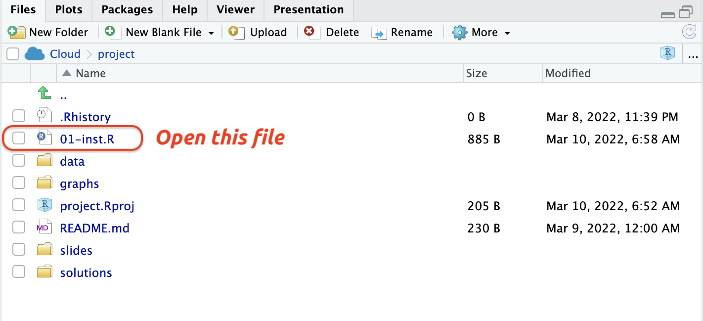
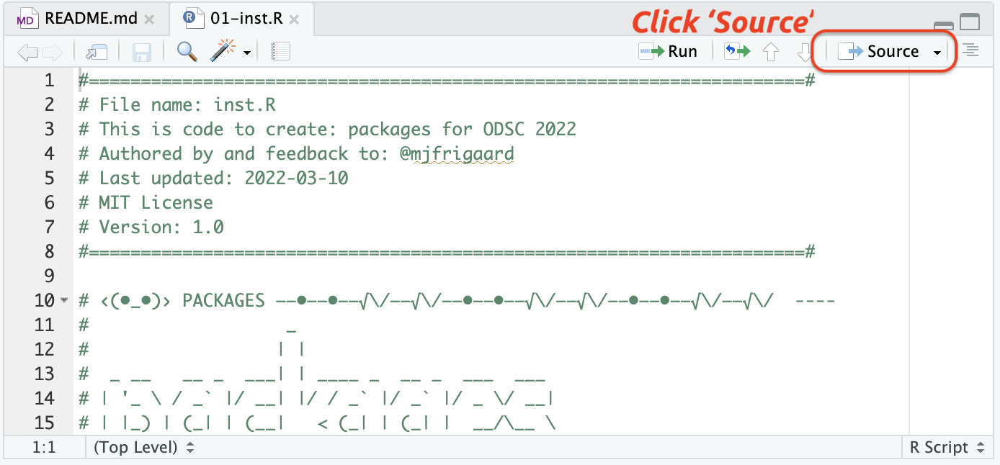
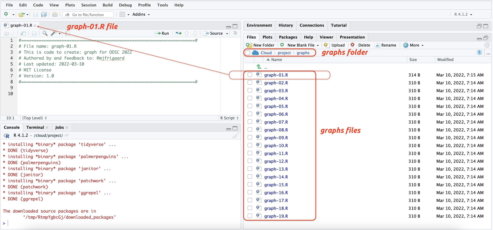
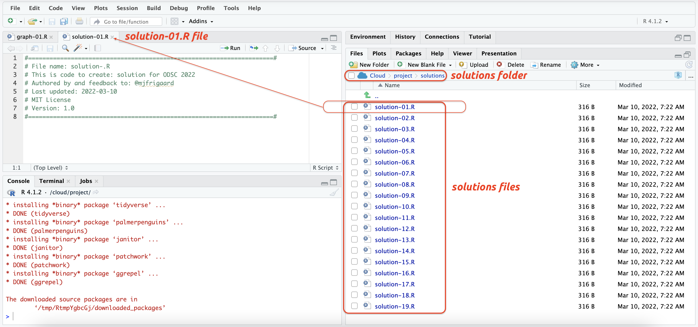
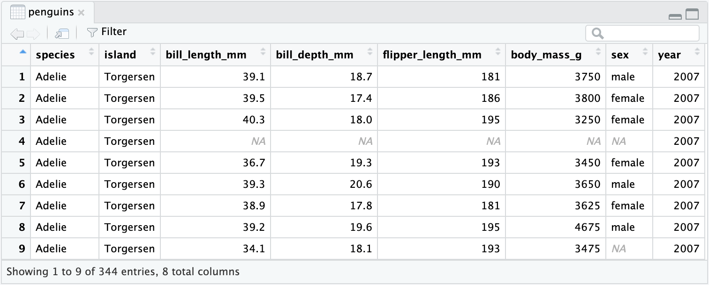
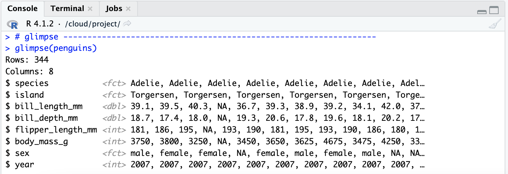
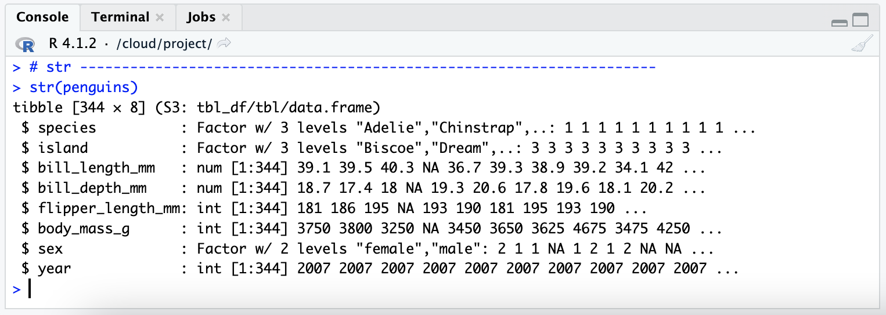

```{r meta, echo=FALSE}
# infinite moon reader ----
# xaringan::inf_mr()
library(metathis)
meta() %>%
  meta_general(
    description = "ODSC: Data Visualization with ggplot2",
    generator = "xaringan and remark.js"
  ) %>%
  meta_name("github-repo" = "mjfrigaard/odsc-ggplot2-2022/tree/gh-pages") %>%
  meta_social(
    title = "ODSC: Data Visualization with ggplot2",
    url = "https://mjfrigaard.github.io/odsc-ggplot2-2022/",
    og_type = "website",
    og_author = "Martin Frigaard",
    twitter_card_type = "summary",
    twitter_creator = "@mjfrigaard"
  )
```

```{r setup, include=FALSE}
dateWritten <- format(as.Date("2022-02-08"), format = "%B %d %Y")
today <- format(Sys.Date(), format = "%B %d %Y")
library(knitr)
library(tidyverse)
library(fontawesome)
options(
  htmltools.dir.version = FALSE,
  knitr.table.format = "html",
  knitr.kable.NA = ""
)
knitr::opts_chunk$set(
  warning = FALSE,
  message = FALSE,
  fig.path = "images/",
  fig.width = 7.252,
  fig.height = 4,
  comment = "#>",
  fig.retina = 3 # Better figure resolution
)
# Enables the ability to show all slides in a tile overview by pressing "o"
xaringanExtra::use_tile_view()
xaringanExtra::use_panelset()
xaringanExtra::use_clipboard()
xaringanExtra::use_share_again()
xaringanExtra::style_share_again(share_buttons = "all")
xaringanExtra::use_extra_styles(
  hover_code_line = TRUE,
  mute_unhighlighted_code = FALSE
)
```

layout: true

<!-- this adds the link footer to all slides, depends on footer-small class in css-->

<div class="footer-small"><span>https://github.com/mjfrigaard/talks/tree/main/odsc-eda-2022-04</span></div>

---
name: title-slide
class: title-slide, center, middle, inverse

# `r rmarkdown::metadata$title`
#.fancy[`r rmarkdown::metadata$subtitle`]

<br>

.large[by Martin Frigaard]

Written: `r dateWritten`

Updated: `r today`

---
class: left, top, inverse
background-image: url(images/ODSC_Logo_2020.png)
background-position: 95% 8%
background-size: 12%

# Resources 

<br>

.leftcol[

## Links:

### - [Conference Website](https://odsc.com/boston/)

### - [Website](https://mjfrigaard.github.io/odsc-ggplot2-2022/)

### - [Part 1](https://mjfrigaard.github.io/odsc-ggplot2-2022/eda-slides-01.html#1)

### - [Part 2](https://mjfrigaard.github.io/odsc-ggplot2-2022/eda-slides-02.html#1)

]

.rightcol[

## Materials:

### - [RStudio.Cloud](https://rstudio.cloud/spaces/225054/project/3704185)

### - [Github Repo](https://github.com/mjfrigaard/odsc-ggplot2-2022/tree/gh-pages) 

]

---
class: left, top, inverse
background-image: url(images/ODSC_Logo_2020.png)
background-position: 95% 8%
background-size: 12%

## Outline 

.leftcol[

### Part 1

**Exploratory Data Analysis**

- *What is it, who does it, and why it's important*

**A Bayesian Mindset**

- *Priors -> new information -> posteriors*

**The grammar of graphics**

- *Layers, aesthetics, and geoms*

]

--
 
.rightcol[

### .red[Part 2]

**Start with labels**

- *Setting your expectations*

**Creating graphs with ggplot2**

- *Building graphs from scratch, layer-by-layer*

**Visual encodings**

- *Using color, size, shape, and facets*

]

---
class: center, middle, inverse
background-image: url(images/ODSC_Logo_2020.png)
background-position: 95% 8%
background-size: 12%

# .fancy[.large[PART 2]]

--

#### .left[*Tip: writing code can be frustrating, especially in the beginning...*]

--

#### .center[*...it doesn't always produce a tangible result...*]

--

#### .right[*...but creating visualizations is rewarding!!!*]


---
class: left, top, inverse
background-image: url(images/ODSC_Logo_2020.png)
background-position: 95% 8%
background-size: 12%

# `ggplot2`: before we start

<br>

### **Build the labels first!**

### - Create a title, subtitle (with data source), and x/y axis labels 

--

.leftcol60[.code60[

```{r labs_pengiuns, eval=FALSE}
labs_pengiuns <- ggplot2::labs(
              title = "Flipper vs. Bill Length", 
              subtitle = "source: palmerpenguins::penguins", 
              x = "flipper length (mm)", 
              y = "bill length (mm)")
```

]]

--

.rightcol40[

.center[.large[.red[<- our expectations]]]

]

---
class: left, top, inverse
background-image: url(images/ODSC_Logo_2020.png)
background-position: 95% 8%
background-size: 12%


# `ggplot2`: build graph, check labels


.leftcol40[.code50[

```{r labs_pengiuns-penguins, echo=FALSE}
penguins <- palmerpenguins::penguins
```

```{r penguins, fig.show='hide'}
labs_pengiuns <- ggplot2::labs(
    title = "Flipper vs. Bill Length", 
    subtitle = "source: palmerpenguins::penguins", 
    x = "flipper length (mm)", 
    y = "bill length (mm)") 

ggplot(data = penguins, 
       mapping = aes(x = bill_length_mm, 
                     y = flipper_length_mm) 
       ) + 
  labs_pengiuns #<<
```


]]

--

.rightcol60[

```{r plot-penguins, ref.label='penguins', echo=FALSE, fig.align='center', out.width='100%', out.height='100%'}

```

### .red[What's wrong here?]


]


---
class: left, top, inverse
background-image: url(images/ODSC_Logo_2020.png)
background-position: 95% 8%
background-size: 12%


## `ggplot2`: build graph, check labels, .red[revise]

--

.leftcol40[.code50[

```{r palmerpenguins-penguins, echo=FALSE}
penguins <- palmerpenguins::penguins
```

```{r penguins-revise, fig.show='hide'}
labs_pengiuns <- ggplot2::labs(
    title = "Flipper vs. Bill Length", 
    subtitle = "source: palmerpenguins::penguins", 
    x = "flipper length (mm)", #<<
    y = "bill length (mm)") #<<

ggplot(data = penguins, 
       mapping = aes(x = flipper_length_mm, #<<
                     y = bill_length_mm) #<<
       ) + 
  labs_pengiuns
```

]]

--

.rightcol60[

```{r plot-penguins-revise, ref.label='penguins-revise', echo=FALSE, fig.align='center', out.width='100%', out.height='100%'}

```

## .green[FIXED!!!]

]


---
class: left, top, inverse
background-image: url(images/ODSC_Logo_2020.png)
background-position: 95% 8%
background-size: 12%


## `ggplot2`: build graph, check labels, .red[REVISE]

> .blue[*Revision Sharpens Thinking: More particularly, rewriting is the key to improved thinking.*]

--

> .blue[*It demands a real open-mindedness and objectivity. It demands a willingness to cull verbiage so that ideas stand out clearly. And it demands a willingness to meet logical contradictions head on and trace them to the premises that have created them.*] 

--

> .red[*In short, it forces a writer to get up his courage and expose his thinking process to his own intelligence.* — Marvin H. Swift, HBR [Clear Writing Means Clear Thinking Means…](https://hbr.org/1973/01/clear-writing-means-clear-thinking-means)]


---
class: center, middle
background-image: url(images/ODSC_Logo_2020.png)
background-position: 95% 8%
background-size: 12%

# **.fancy[.darkblue[.large[Exercises & Solutions]]]**

---
class: left, top, inverse
background-image: url(images/ODSC_Logo_2020.png)
background-position: 97% 6%
background-size: 8%

# RStudio.Cloud: Set up

### In your RStudio.Cloud, you will see the following: 

```{r rscloud-landing, echo=FALSE, fig.align='center', out.height='90%', out.width='90%'}

```

### Click on .red[odsc-ggplot2-2022] project

---
class: left, top, inverse
background-image: url(images/ODSC_Logo_2020.png)
background-position: 97% 6%
background-size: 8%

# RStudio.Cloud: Set up

### In your RStudio IDE, you will see the following: 

```{r rscloud-env, echo=FALSE, fig.align='center', out.height='80%', out.width='80%'}
knitr::include_graphics("images/rscloud-env.png")
```

---
class: left, top, inverse
background-image: url(images/ODSC_Logo_2020.png)
background-position: 97% 6%
background-size: 8%

# RStudio.Cloud: Set up

### In the .blue[Files] pane, click on the `inst.R` file to open it

```{r rscloud-open-inst, echo=FALSE, fig.align='center', out.height='80%', out.width='80%'}

```


---
class: left, top, inverse
background-image: url(images/ODSC_Logo_2020.png)
background-position: 97% 6%
background-size: 8%

# RStudio.Cloud: Set up

### In the .blue[Source] pane, click on the *Source* icon to run `inst.R`

```{r rscloud-source-inst, echo=FALSE, fig.align='center', out.height='60%', out.width='60%'}

```

### This sends the code in the .blue[Source] pane to the .blue[Console]


---
class: left, top, inverse
background-image: url(images/ODSC_Logo_2020.png)
background-position: 97% 6%
background-size: 8%

# RStudio.Cloud: Exercises 

### The exercises are in the `graphs/` folder 

```{r graphs-files, echo=FALSE, fig.align='center', out.height='80%', out.width='80%'}

```

---
class: left, top, inverse
background-image: url(images/ODSC_Logo_2020.png)
background-position: 97% 6%
background-size: 8%

# RStudio.Cloud: Solutions 

### Each exercise has a solution file in `solutions/` folder

```{r sols-files, echo=FALSE, fig.align='center', out.height='80%', out.width='80%'}

```


---
class: left, top, inverse
background-image: url(images/ODSC_Logo_2020.png)
background-position: 97% 6%
background-size: 8%

# The data 

### We're going to use the `palmerpenguins::penguins`

### - Below are three options for viewing a dataset in RStudio:

--

.cols3[.code90[

```{r view-penguins, eval=FALSE}
View(penguins)
```


]]

--

.cols3[.code90[

```{r glimpse-penguins, eval=FALSE}
glimpse(penguins)
```

]]

--

.cols3[.code90[

```{r str-penguins, eval=FALSE}
str(penguins)
```

]]

---
class: left, top, inverse
background-image: url(images/ODSC_Logo_2020.png)
background-position: 97% 6%
background-size: 8%

# Viewing data

### `View()` opens the RStudio data viewer

```{r penguins-View, echo=FALSE, fig.align='center', out.height='80%', out.width='80%'}

```


---
class: left, top, inverse
background-image: url(images/ODSC_Logo_2020.png)
background-position: 97% 6%
background-size: 8%

# Viewing data

### `glimpse()` and `str()` are displayed in the console

.leftcol[

```{r penguins-glimpse, echo=FALSE, fig.align='center', out.height='100%', out.width='100%'}

```

]

.rightcol[

```{r penguins-str, echo=FALSE, fig.align='center', out.height='100%', out.width='100%'}

```

]

---
class: center, middle
background-image: url(images/ODSC_Logo_2020.png)
background-position: 95% 8%
background-size: 12%

# **.fancy[.darkblue[.large[Build from scratch, layer-by-layer]]]**

---
class: left, top, inverse
background-image: url(images/ODSC_Logo_2020.png)
background-position: 97% 6%
background-size: 8%

# .red[graph 01] Layer 0 = LABELS! 

We want to build the labels **first**:

- title = "Bill and flipper length of Palmer penguins"
- subtitle = "Size measurements for adult foraging penguins"
- x = "Bill length (mm)"
- y = "Flipper length (mm)"

```{r labs_g01, eval=TRUE}
# build labels 
labs_bill_vs_flippper <- ggplot2::labs(
  title = "Bill and flipper length of Palmer penguins", 
  subtitle = "Size measurements for adult foraging penguins",
  x = "Bill length (mm)", 
  y = "Flipper length (mm)")
```


---
class: left, top, inverse
background-image: url(images/ODSC_Logo_2020.png)
background-position: 97% 6%
background-size: 8%

# .red[graph 01] Layer 1: Initialize plot with data


.leftcol[

.small[The `ggplot2::ggplot()` function initiates the plot]

.code60[

```{r g01-ggplot-fun, eval=FALSE}
ggplot(data = )
```

]

.small[Place `penguins` in the data argument]

.code60[

```{r g01-initialize, fig.show='hide'}
ggplot(data = penguins) #<< 
```

]
]

--

.rightcol[

.small[This gives us a blank canvas!]

.code60[

```{r g01-initialize-out, ref.label='g01-initialize', echo=FALSE, fig.align='center', out.width='100%', out.height='100%'}

```

]
]

---
class: left, top, inverse
background-image: url(images/ODSC_Logo_2020.png)
background-position: 97% 6%
background-size: 8%

# .red[graph 02] Layer 2: Map variables to positions

We have our data and labels--we just need to add our variables

.leftcol[

.small[Map `bill_length_mm` to `x`]

.code60[

```{r g02-map-x, eval=FALSE}
ggplot(data = penguins, 
       mapping = aes(x = bill_length_mm, #<<
                     )) 
```

]

.small[Map `flipper_length_mm` to `y`]

.code60[

```{r g02-position, fig.show='hide'}
ggplot(data = penguins, 
       mapping = aes(x = bill_length_mm, #<<
                     y = flipper_length_mm)) #<<
```

]
]

--

.rightcol[

.small[Now our canvas has `x` and `y` axes]

```{r g02-position-out, ref.label='g02-position', echo=FALSE, fig.align='center', out.width='100%', out.height='100%'}

```

]

--

<br><br><br>

Now we have our variables on our graph!

---
class: left, top, inverse
background-image: url(images/ODSC_Logo_2020.png)
background-position: 97% 6%
background-size: 8%

# .red[graph 03] Layer 3: Adding geoms


.leftcol[

Add the `geom_point()` function with the `+` symbol

.code60[

```{r g03-geom, fig.show='hide'}
ggplot(data = penguins, 
       mapping = aes(x = bill_length_mm, 
                     y = flipper_length_mm)) + 
       geom_point() #<<
```

]
]

--

.rightcol[

The `geom_point()` function tells R we want to see the points (or dots) on our canvas

```{r g03-geom-out, ref.label='g03-geom', echo=FALSE, fig.align='center', out.width='100%', out.height='100%'}

```

]


---
class: left, top, inverse
background-image: url(images/ODSC_Logo_2020.png)
background-position: 97% 6%
background-size: 8%

# .red[graph 04] Layer 4: Don't forget the labels! 


.leftcol[

.small[Finally, we want to add the labels we created (`labs_bill_vs_flippper`)]

.code60[

```{r g04-labels, fig.show='hide'}
ggplot(data = penguins, 
       mapping = aes(x = bill_length_mm, 
                     y = flipper_length_mm)) + 
  geom_point() + 
  labs_bill_vs_flippper #<<
```

]
]

--

.rightcol[

.small[And we have our first graph!]

```{r g04-labels-out, echo=FALSE, ref.label='g04-labels', fig.align='center', out.width='100%', out.height='100%'}

```

]

---
class: center, middle
background-image: url(images/ODSC_Logo_2020.png)
background-position: 95% 8%
background-size: 12%

# **.fancy[.darkblue[.large[Detour: global vs. local mapping]]]**

---
class: left, top, inverse
background-image: url(images/ODSC_Logo_2020.png)
background-position: 97% 6%
background-size: 8%

# Global vs. local mapping

We've just created a graph by setting .green[global] aesthetics 

.green[Global] means aesthetic mappings are set when the graph is initialized with the `ggplot()` function

--

.leftcol[

.code60[

```{r global-mappings, eval=FALSE}
ggplot(data = penguins, 
       mapping = aes(x = bill_length_mm, #<<
                     y = flipper_length_mm)) + #<<
  geom_point() + 
  labs_bill_vs_flippper
```
]

.small[If we map aesthetics `ggplot()`, all the following `geom_*()` layers will inherit these aesthetics.]

]

--

.rightcol[

.small[Recall what goes into each layer from Part 1]

```{r data-layer, eval=TRUE, echo=FALSE, fig.align='center', out.height='52%', out.width='52%'}
knitr::include_graphics("images/layer-breakdown-01.png")
```


]


---
class: left, top, inverse
background-image: url(images/ODSC_Logo_2020.png)
background-position: 97% 6%
background-size: 8%

# Global vs. local mapping

Mapping aesthetics .green[globally] and then adding the `geom_*()` function results in the same graph as when we map aesthetics .green[locally] (*inside* the `geom_*()` function)


.leftcol[
.code40[

```{r g05-global, fig.show='hide'}
ggplot(data = penguins,
       mapping = aes(x = bill_length_mm, #<<
                     y = flipper_length_mm)) + #<<
  geom_point() + #<<
  labs_bill_vs_flippper
```

```{r g05-global-out, ref.label='g05-global', echo=FALSE, fig.align='right', out.width='80%', out.height='80%'}

```

]]


--

.rightcol[ 
.code40[

```{r g05-local, fig.show='hide'}
ggplot(data = penguins) + 
  geom_point( #<<
    mapping = aes(x = bill_length_mm, #<<
                  y = flipper_length_mm)) + #<<
  labs_bill_vs_flippper
```

```{r g05-local-out, ref.label='g05-local', echo=FALSE, fig.align='left', out.width='80%', out.height='80%'}

```

]

]


---
class: left, top, inverse
background-image: url(images/ODSC_Logo_2020.png)
background-position: 97% 6%
background-size: 8%

# Our `ggplot2` templates

The template from part 1 uses .green[local] mappings (i.e. aesthetic mappings are set *inside* the `geom_*` function). 

```{r recall-template-01, eval=FALSE, echo=TRUE}
# Recall our template from Part 1
ggplot(data = <DATA>) +
     geom_*(mapping = aes(<AESTHETIC MAPPINGS>)) 
```

--

We could adjust this template to include .green[global] mappings (and the option to include aesthetic mappings .green[locally])

```{r adjusted-template-01, eval=FALSE, echo=TRUE}
# Adjusted template
ggplot(data = <DATA>, 
       mapping = aes(<AESTHETIC MAPPINGS>)) + # global mappings #<<
       geom_*(mapping = aes(<AESTHETIC MAPPINGS>)) # local mappings #<<
```

.small[Read more [here](https://ggplot2-book.org/collective-geoms.html#different-groups-on-different-layers).]

---
class: left, top, inverse
background-image: url(images/ODSC_Logo_2020.png)
background-position: 97% 6%
background-size: 8%

# .red[graph 05] Convert .green[global] to .green[local] mappings

For .red[graph 05.R], convert the global aesthetics to local aesthetics inside the `geom_point()` function

.leftcol[

Global 

.code80[

```{r global-to-local, eval=FALSE}
ggplot(data = penguins, 
  mapping = aes(x = bill_length_mm, #<<
             y = flipper_length_mm)) + #<<
  geom_point() + 
  labs_bill_vs_flippper
```


]
]

--

.rightcol[

Local

.code80[

```{r convert-global-to-local, eval=FALSE}
ggplot(data = penguins) + 
  geom_point(
    mapping = aes(x = bill_length_mm, #<<
             y = flipper_length_mm)) + #<<
  labs_bill_vs_flippper
```

]
]

---
class: center, middle
background-image: url(images/ODSC_Logo_2020.png)
background-position: 95% 8%
background-size: 12%

# **.fancy[.darkblue[.large[Visual encodings]]]**

---
class: left, top, inverse
background-image: url(images/ODSC_Logo_2020.png)
background-position: 97% 6%
background-size: 8%

# What are visual encodings?

--

### Visual encodings are what we see on the graph 

--

### Things like position, size, shape, color, etc.

--

### Ranked by accuracy ("generally speaking"):

```{r visual-encodings, echo=FALSE, fig.align='center', out.height='90%', out.width='90%'}
knitr::include_graphics("images/visual-encodings.png")
```


---
class: left, top, inverse
background-image: url(images/ODSC_Logo_2020.png)
background-position: 97% 6%
background-size: 8%

# .red[graph 06] Adding color (global)

Map `color` to the `species` variable in the scatter plot using .green[global] aesthetic mapping

--

.leftcol[

.code60[

```{r g06-color, fig.show='hide'}
ggplot(data = penguins,
       mapping = 
         aes(x = bill_length_mm, #<<
             y = flipper_length_mm, #<<
             color = species)) + #<<
  geom_point() + 
  labs_bill_vs_flippper
```


]
]

--

.rightcol[

```{r g06-color-out, ref.label='g06-color', echo=FALSE, fig.align='center', out.width='100%', out.height='100%'}

```

]


---
class: left, top, inverse
background-image: url(images/ODSC_Logo_2020.png)
background-position: 97% 6%
background-size: 8%

# .red[graph 07] Adding color (local)

Map `color` to the `species` variable in the scatter plot using .green[local] aesthetic mapping

.leftcol[

.code60[

```{r g07-color-local, fig.show='hide'}
ggplot(data = penguins,
       mapping = 
         aes(x = bill_length_mm, 
             y = flipper_length_mm)) + 
  geom_point(aes(color = species)) + #<<
  labs_bill_vs_flippper
```


]
]

--

.rightcol[

```{r g07-color-local-out, ref.label='g07-color-local', echo=FALSE, fig.align='center', out.width='100%', out.height='100%'}

```

.small[The `x` and `y` aesthetics are inherited from the `ggplot()` function, but the `color` aesthetic comes from the `geom_point()` layer]

]

---
class: left, top, inverse
background-image: url(images/ODSC_Logo_2020.png)
background-position: 97% 6%
background-size: 8%

# .red[graph 08] Color vs. Fill

Below we'll look at the counts of `sex` vs. `species` of Palmer penguins

--

.leftcol[

.small[Create labels] 

.code60[

```{r g08-labs_sex_vs_species}
labs_sex_vs_species <- ggplot2::labs(
  title = "Sex by species of Palmer penguins", 
  subtitle = "Counts for adult foraging penguins",
  x = "Sex", 
  fill = "Species")
```

.small[Create `penguins_no_miss` by removing missing values]

```{r g08-penguins_no_miss, eval=TRUE}
penguins_no_miss <- drop_na(data = penguins)
```

]
]


--

.rightcol[

.small[View the `penguins_no_miss` data]

.code60[

```{r glimpse-penguins_no_miss, eval=FALSE}
glimpse(penguins_no_miss)
```


```{r glimpse-penguins_no_miss-out, echo=FALSE}
glimpse(penguins_no_miss, 50)
```


]
]


---
class: left, top, inverse
background-image: url(images/ODSC_Logo_2020.png)
background-position: 97% 6%
background-size: 8%

# .red[graph 08] Color vs. Fill

It's important to note that some `geom_*()` functions take the `fill` argument instead of `color`

.leftcol[

.small[Build a bar-graph using `geom_bar()` using .green[local] aesthetic mapping]

.small[Map `sex` to the `x` axis and `y` to `fill`]

.code60[

```{r g08-geom_bar, fig.show='hide'}
ggplot(data = penguins_no_miss) + 
  geom_bar(mapping = aes(x = sex, 
                         fill = species)) + #<<
  labs_sex_vs_species
```

]

.small[Don't forget the labels!]

]

--

.rightcol[

```{r g08-geom_bar-out, ref.label='g08-geom_bar', echo=FALSE, fig.align='center', out.width='100%', out.height='100%'}

```

]

---
class: left, top, inverse
background-image: url(images/ODSC_Logo_2020.png)
background-position: 97% 6%
background-size: 8%

# .red[graph 09] Change position

Stacked bar-graphs make it difficult to do side-by-side comparisons  using the `y` axis 

.leftcol[

.small[Using the same code as .red[graph 08], add the `position = "dodge"` argument *outside* the `aes()` function]

.code60[

```{r g08-dodge, fig.show='hide'}
ggplot(data = penguins_no_miss) + 
  geom_bar(mapping = aes(x = sex, 
                         fill = species), 
           position = "dodge") + #<<
  labs_sex_vs_species
```


]
]

--

.rightcol[

```{r g08-dodge-out, ref.label='g08-dodge', echo=FALSE, fig.align='center', out.width='100%', out.height='100%'}

```

]


---
class: left, top, inverse
background-image: url(images/ODSC_Logo_2020.png)
background-position: 97% 6%
background-size: 8%

# .red[graph 10] Histograms (special bar-graphs)

The `geom_histogram()` function uses 'bins' to represent counts for each value


.leftcol[

.small[Create new labels]

.code60[

```{r labs_bodymass_vs_species}
labs_bodymass_vs_species <- ggplot2::labs(
  title = "Body mass by species of Palmer penguins", 
  subtitle = "Counts for adult foraging penguins",
  x = "Body Mass (grams)", 
  fill = "Species")
```

]

.small[Create a histogram of `body_mass_g`, colored (filled) by `island`]

.code60[

```{r g10-hist, fig.show='hide'}
ggplot(data = penguins) + 
  geom_histogram(
    mapping = aes(x = body_mass_g, #<<
                  fill = species)) + #<<
  labs_bodymass_vs_species
```

]
]

--

.rightcol[

.small[Notice the overlapping distributions of `body_mass_g`]

```{r g10-hist-out, ref.label='g10-hist', echo=FALSE, fig.align='center', out.width='100%', out.height='100%'}

```

]


---
class: left, top, inverse
background-image: url(images/ODSC_Logo_2020.png)
background-position: 97% 6%
background-size: 8%

# .red[graph 11] Density plots 

Density plots are also great for comparing overlapping distributions

.leftcol[

.small[Create a density plot with `geom_density()`]

.small[Change the color saturation by setting .red[alpha] to `1/2`]

.code60[

```{r g11-alpha, fig.show='hide'}
ggplot(data = penguins) + 
  geom_density(
    mapping = aes(x = body_mass_g, 
                  fill = species),
    alpha = 1/2) + #<<
  labs_bodymass_vs_species
```

]
]

--

.rightcol[

```{r g11-alpha-out, ref.label='g11-alpha', echo=FALSE, fig.align='center', out.width='100%', out.height='100%'}

```

.small[Also check out [ridgeline plots](https://mjfrigaard.github.io/odsc-ggplot2-2022/eda-graph gallery.html#74)]

]


---
class: left, top, inverse
background-image: url(images/ODSC_Logo_2020.png)
background-position: 97% 6%
background-size: 8%

# Mapping vs. setting aesthetics

.leftcol[

.small[
The last few graphs have mapped aesthetics inside and outside the `aes()` function
]

.code40[

```{r map-aes, fig.align='center', out.width='90%', out.height='90%'}
ggplot(data = penguins_no_miss) + 
  geom_point(
    mapping = aes(x = bill_length_mm, 
                  y = flipper_length_mm,
                  color = sex)) + 
  labs_bill_vs_flippper
```

]
]

--

.rightcol[

.small[
Inside the `aes()` function is 'mapping', outside the `aes()` function is 'setting'
]

.code40[

```{r set-aes, fig.align='center', out.width='90%', out.height='90%'}
ggplot(data = penguins_no_miss) + 
  geom_point(
    mapping = aes(x = bill_length_mm, 
                  y = flipper_length_mm),
                  color = "dodgerblue") + 
  labs_bill_vs_flippper
```

]
]

---
class: left, top, inverse
background-image: url(images/ODSC_Logo_2020.png)
background-position: 97% 6%
background-size: 8%

# .red[graph 12] Setting graph aesthetics 

Change the code below to make the points `"firebrick"` red

.leftcol[

.small[Create labels]

.code40[

```{r labs_body_mass_vs_bill_depth}
labs_body_mass_vs_bill_depth <- ggplot2::labs(
  title = "Body mass and bill depth of Palmer penguins", 
  subtitle = "Size measurements for adult foraging penguins",
  x = "Body mass (mm)", 
  y = "Bill depth (mm)")
```

]

.small[What is wrong with the code below?]

.code60[

```{r g12-set, fig.show='hide'}
ggplot(data = penguins) + 
  geom_point(
    mapping = aes(x = body_mass_g, 
                  y = bill_depth_mm,
                  color = "firebrick")) + 
  labs_body_mass_vs_bill_depth
```

]
]

--

.rightcol[

```{r g12-set-out, ref.label='g12-set', echo=FALSE, fig.align='center', out.width='100%', out.height='100%'}

```

.small[TIP: the legend tells us `geom_point()` is looking for a mapped variable in the penguins dataset named `"firebrick"`]

]


---
class: left, top, inverse
background-image: url(images/ODSC_Logo_2020.png)
background-position: 97% 6%
background-size: 8%

# .red[graph 13] New layer? New data

Each `geom_*()` function also has a `data` argument, so we can supply new data at each layer! 

.leftcol[

.small[Create labels]

.code50[

```{r g13-labs_body_mass_vs_bill_depth}
labs_body_mass_vs_bill_depth <- ggplot2::labs(
  title = "Body mass and bill depth of Palmer penguins", 
  subtitle = "Size measurements for adult foraging penguins",
  x = "Body mass (mm)", 
  y = "Bill depth (mm)",
  color = "Sex")
```


]

.small[Create `big_penguins` and `label`]

.code40[

```{r g13-big_penguins}
big_penguins <- bind_rows(
  slice_max(.data = penguins, bill_depth_mm, n = 1),
  slice_max(.data = penguins, body_mass_g, n = 1))
big_penguins <- mutate(.data = big_penguins, 
         label = case_when(
  bill_depth_mm == 21.5 ~ paste0("bill depth = ", bill_depth_mm),
  body_mass_g == 6300 ~ paste0("body mass = ", body_mass_g)))
```


]

]

--

.rightcol[

.small[View `big_penguins`]

.small[

```{r g13-view-big_penguins, echo=FALSE}
rmarkdown::paged_table(big_penguins)
```

]

]


---
class: left, top, inverse
background-image: url(images/ODSC_Logo_2020.png)
background-position: 97% 6%
background-size: 8%

# .red[graph 13] Add layer with new data

We'll use the `geom_label_repel()` function from the [`ggrepel` package](https://cran.r-project.org/web/packages/ggrepel/vignettes/ggrepel.html) to label the data in `big_penguins`

.leftcol40[

.code50[

```{r g13-geom_label_repel, fig.show='hide'}
ggplot(data = penguins_no_miss) + 
  geom_point(
    mapping = aes(x = body_mass_g, 
                  y = bill_depth_mm, 
                  color = sex)) + 
  # new data, layer and geom!
  ggrepel::geom_label_repel(
    data = big_penguins, 
      mapping = aes(x = body_mass_g, 
                    y = bill_depth_mm,
                    label = label)) + 
  labs_body_mass_vs_bill_depth
```


]
]

--

.rightcol60[


```{r g13-geom_label_repel-out, ref.label='g13-geom_label_repel', echo=FALSE, fig.align='center', out.width='100%', out.height='100%'}

```

]


---
class: left, top, inverse
background-image: url(images/ODSC_Logo_2020.png)
background-position: 97% 6%
background-size: 8%

# .red[graph 14]


---
class: left, top, inverse
background-image: url(images/ODSC_Logo_2020.png)
background-position: 97% 6%
background-size: 8%

# .red[graph 15]

---
class: left, top, inverse
background-image: url(images/ODSC_Logo_2020.png)
background-position: 97% 6%
background-size: 8%

# .red[graph 16]


---
class: left, top, inverse
background-image: url(images/ODSC_Logo_2020.png)
background-position: 95% 8%
background-size: 12%

# `ggplot2`: templates


.leftcol55[

### Basic Template: Data, aesthetic mappings, geom

.code70[

```{r , eval=FALSE, echo=TRUE}
ggplot(data = <DATA>) +
     geom_*(mapping = aes(<AESTHETIC MAPPINGS>)) 
```

]
]

.rightcol45[

<br>

```{r , eval=TRUE, echo=FALSE, fig.align='center', out.height='83%', out.width='83%'}
knitr::include_graphics("images/layer-breakdown-01.png")
```

]

---
class: center, middle, inverse, no-slide-number
background-image: url(images/ODSC_Logo_2020.png)
background-position: 95% 8%
background-size: 12%

# Thanks!

.footer-large[
.right[
[@mjfrigaard `r fa(name = "twitter", fill = "white")`](http://twitter.com/mjfrigaard)<br>
[@mjfrigaard `r fa(name = "github", fill = "white")`](http://github.com/mjfrigaard)<br>
[mjfrigaard@pm.e `r fa(name = "paper-plane", fill = "white")`](mailto:mjfrigaard@pm.me)<br>
[What does "λέξις" mean?](https://jhelvy.github.io/lexis/index.html#what-does-%CE%BB%CE%AD%CE%BE%CE%B9%CF%82-mean)
]]

