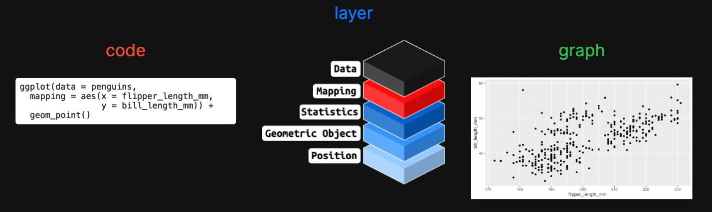
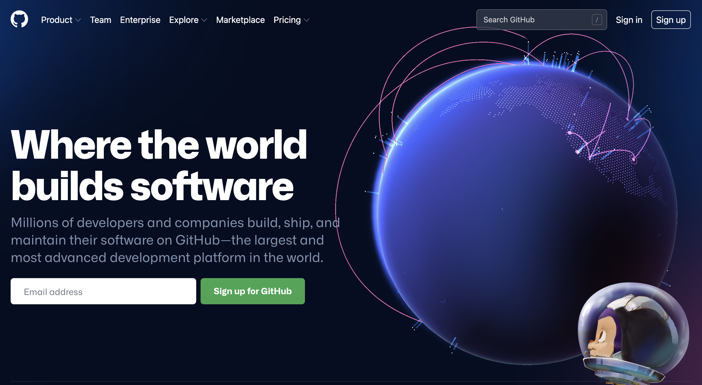

<br>

```{r odsc-talk-image-png, echo=FALSE, fig.align='center', out.height='100%', out.height='100%'}

```

[Read the ODSC blog post](https://opendatascience.com/ggplot2-a-framework-for-thinking-with-graphs/).

<br><br>


***

## Setup

<br><br>

### 1. Head over to [GitHub](https://github.com/) and set up a free account

```{r github-signup-png, echo=FALSE, fig.align='right', out.height='50%', out.height='50%'}

```

<br><br>

### 2. Create your [RStudio.Cloud account](https://rstudio.cloud/plans/free) (also free!)


```{r rstudio-cloud-signup-png, echo=FALSE, fig.align='right', out.height='50%', out.height='50%'}
knitr::include_graphics("images/rstudio-cloud-signup.png")
```

<br><br>

### 3. Use your GitHub credentials to [log into RStudio.Cloud](https://client.login.rstudio.cloud/oauth/register?redirect=https%3A%2F%2Fclient.login.rstudio.cloud%2Foauth%2Flogin%3Fshow_auth%3D0%26show_login%3D0) 

```{r rscloud-github-cred-png, echo=FALSE, fig.align='center', out.height='100%', out.height='100%'}
knitr::include_graphics("images/rscloud-github-cred.png")
```

<br><br>

***

## Materials 

<br><br>

### [Part 1: thinking with graphs](https://mjfrigaard.github.io/odsc-ggplot2-2022/ggplot2-slides-01.html#1)

**Exploratory data analysis**

- *What is it, who does it, and why it's important*

**A Bayesian mindset**

- *Priors -> new information -> posteriors*

**The grammar of graphics**

- *Layers, aesthetics, and geoms*

<br><br>
  
### [Part 2: creating graphs with ggplot2](https://mjfrigaard.github.io/odsc-ggplot2-2022/ggplot2-slides-02.html#1) 

**Build labels first**

- *Set expectations*

**Exercises & solutions**

- *[RStudio.Cloud materials](https://rstudio.cloud/spaces/225054/content/all?sort=name_asc)*

**Creating graphs**

- *Building graphs layer-by-layer, global vs. local mapping, visual encodings*

**Applying the grammar**

- *Mapping vs. setting aesthetics, combining layers, facets*

<br>

***

## Slides as .pdfs

+ **[Part 1](https://github.com/mjfrigaard/odsc-ggplot2-2022/blob/gh-pages/pdfs/ggplot2-slides-01.pdf)**

+ **[Part 2](https://github.com/mjfrigaard/odsc-ggplot2-2022/blob/gh-pages/pdfs/ggplot2-slides-02.pdf)**

<br>

***

<br>

## More Resources 


- Read [previous tutorials](https://www.storybench.org/getting-started-data-visualization-r-using-ggplot2/) on `ggplot2`

- [ODSC blog](https://odsc.com/blog/)

- [Conference page](https://odsc.com/boston/) 
