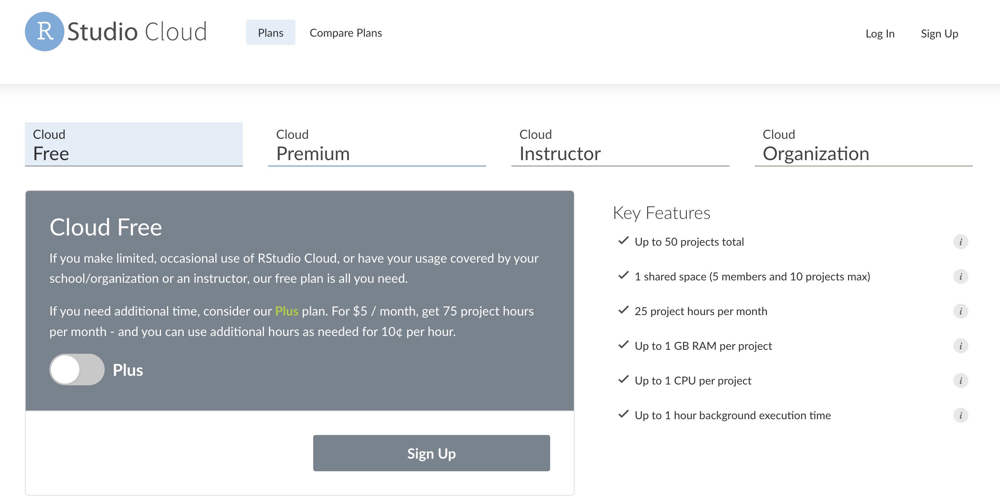

```{r ggplot2-png, echo=FALSE, fig.align='right', out.height='100%', out.height='100%'}
knitr::include_graphics("images/ggplot2.png")
```

<br><br>

Read the preview full blog post [here](https://opendatascience.com/ggplot2-a-framework-for-thinking-with-graphs/).

***

## Getting setup with RStudio.Cloud

#### 1. Create a [GitHub account](https://github.com/) (it's free!)

```{r github-signup-png, echo=FALSE, fig.align='right', out.height='50%', out.height='50%'}

```

#### 2. Create [RStudio.Cloud account](https://rstudio.cloud/plans/free) (also free!)


```{r rstudio-cloud-signup-png, echo=FALSE, fig.align='right', out.height='50%', out.height='50%'}

```

#### 3. Use your GitHub credentials to [log into RStudio.Cloud](https://client.login.rstudio.cloud/oauth/register?redirect=https%3A%2F%2Fclient.login.rstudio.cloud%2Foauth%2Flogin%3Fshow_auth%3D0%26show_login%3D0) 

```{r rscloud-github-cred-png, echo=FALSE, fig.align='center', out.height='100%', out.height='100%'}

```

***

## Materials 

### [Part 1: thinking with graphs](https://mjfrigaard.github.io/odsc-ggplot2-2022/ggplot2-slides-01.html#1)

**Exploratory data analysis**

- *What is it, who does it, and why it's important*

**A Bayesian mindset**

- *Priors -> new information -> posteriors*

**The grammar of graphics**

- *Layers, aesthetics, and geoms*
  
### [Part 2: creating graphs with ggplot2](https://mjfrigaard.github.io/odsc-ggplot2-2022/ggplot2-slides-02.html#1) 

**Build labels first**

- *Set expectations*

**Exercises & solutions**

- *[RStudio.Cloud materials](https://rstudio.cloud/spaces/225054/content/all?sort=name_asc)*

**Creating graphs**

- *Building graphs layer-by-layer, global vs. local mapping, visual encodings*

**Applying the grammar**

- *Mapping vs. setting aesthetics, combining layers, facets*

<!--

- A collection of common graphs and code.

-->

***

## Slides as .pdfs

+ **[Part 1](https://github.com/mjfrigaard/odsc-ggplot2-2022/blob/gh-pages/pdfs/ggplot2-slides-01.pdf)**

+ **[Part 2](https://github.com/mjfrigaard/odsc-ggplot2-2022/blob/gh-pages/pdfs/ggplot2-slides-02.pdf)**

<!-- https://mjfrigaard.github.io/odsc-ggplot2-2022/ggp2-gallery-03-proportions.html#1 -->


## More Resources 

Read [previous tutorials](https://www.storybench.org/getting-started-data-visualization-r-using-ggplot2/) on `ggplot2`.  
